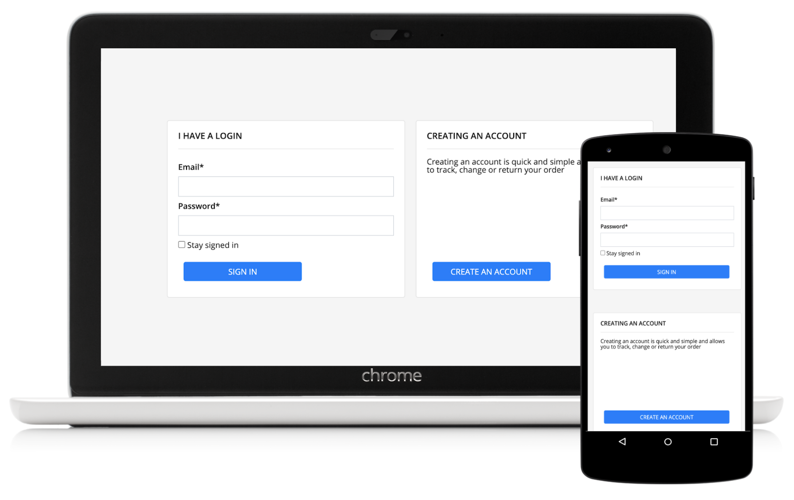

My approach:

**HTML**
For this I used one global container to hold all the pages content, then divided this up into two div `cards`. The first is a login html form and the second div is a create account div. 

**Javascript**
For the logic, I have completed the `validatePassword` function first using regEx to test the password.

Then I completed the `init` function. First saving the values into variables via jQuery. Next on the event loop is to validate both email and password next and saving both outputs as `validatedEmail` and `validatedPassword`. If the output is false (i.e not validated) an error message will appear next to the input field.

Next, on the event loop is to validate if `validatedEmail` AND `validatedPassword`. If both of conditions are true - this allows a user to login.

**css**
I have used Bootstrap css style sheet and customized styles using CSS. Using bootstraps grid layout and media queries for mobile responsive design.

SB Assignment

==============

**Instructions:**

The purpose of this assessment is to complete a simple programming assignment.
You are expected to work on this task on your own, without help or advice from others. 
If you need clarification on any aspect of the assessment, please seek help from your organiser.

Please download and complete the coding assignment within a day.

**Coding Assignment:**

- Create a simple login/registration page like the image example 'login-page.png'.
- Code a responsive login/registration page in HTML5/CSS & JavaScript.
- The JavaScript should be well structured and suitably commented.

**You are required to:**

- Use the provided index.html to build the login page.
- Use the css/style.css to code the styling.
- Use the js/script.js to code the form submission, email and password validation.

**HTML & CSS:**

- The HTML & CSS code should be valid and has to meet the W3C standard.

**JS:**

- The email and password will need to be validated before the form can be submitted.
- Add an error message if the email or password are not valid.
- You can use jQuery if needed.